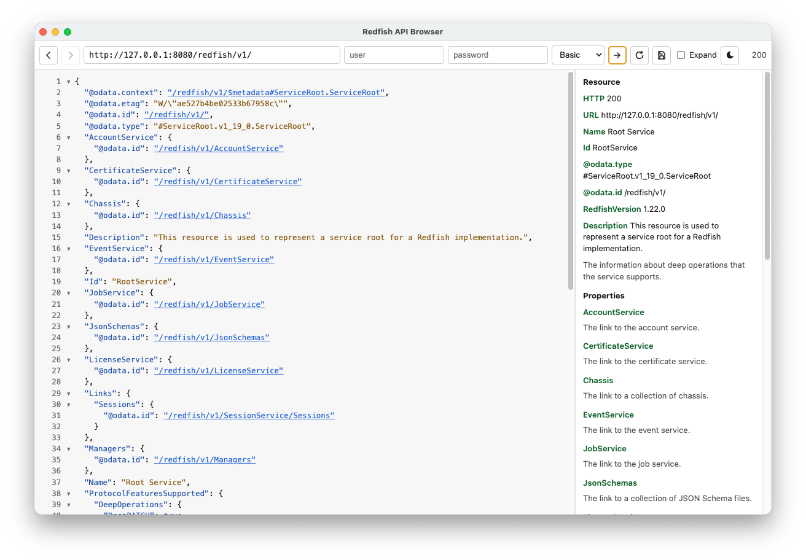

# Redfish API Browser

A small Electron app for poking around a Redfish API. Fully vibecoded. Not a production client, not a management tool, just a browser for reading what a BMC actually returns.



## Run

```sh
npm install
npm start
```

Default URL is `http://127.0.0.1:8080/redfish/v1`. Point it at any Redfish service. Self-signed BMC certificates are accepted.

## What it does

- Basic auth and Redfish session login (`POST` to the Sessions collection, then `X-Auth-Token`)
- Pretty-printed JSON, keys sorted at every level for BMCs that shuffle the response with every request
- Collapse and expand objects and arrays
- Clickable `@odata.id`, `@odata.nextLink`, `target`, and `/redfish/…` links
- Optional **Expand** to inline one level of child resources
- Search with `Ctrl + F` or `Cmd + F`
- Save the response to a JSON file
- Follow redirects (`300`–`303`, and `307`/`308`) on the same host
- Side panel with resource identity and property text from the matching DMTF schema, when that file is reachable
- Light and dark themes

Requests go out from the Electron main process, with no cookie jar. Auth is only the `Authorization` or `X-Auth-Token` header on that call, so browser CORS and cookie CSRF do not get in the way.
